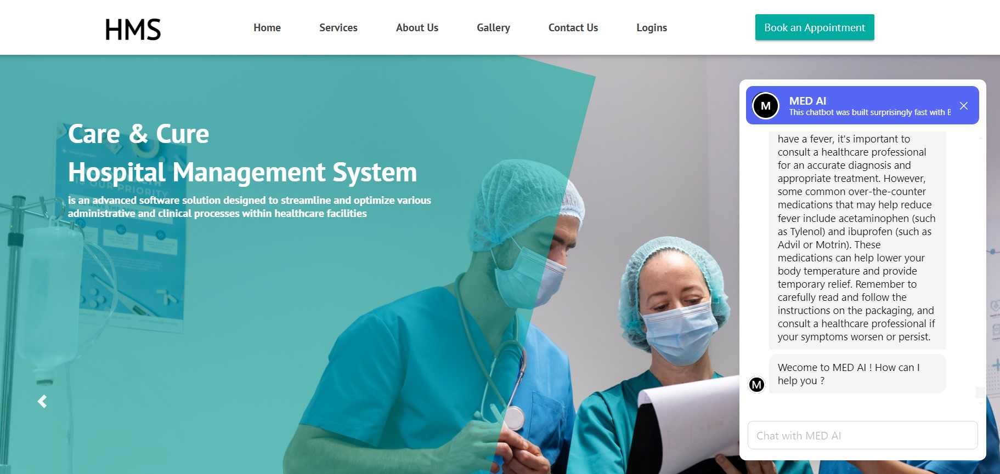

# URECKATHON (Track: Health Tech)

## Hospital Management System Care and Cure

Welcome to the Hospital Management System **Care and Cure** repository, developed by **Byte Hogs**.

## Problem Statement
The project addresses the challenge of managing healthcare resources effectively, including patient records, appointments, medical histories, and communication between healthcare providers and patients. It aims to solve the issues of inefficiency, long waiting times, and miscommunication often encountered in traditional healthcare systems.

## Domain
The project belongs to the healthcare industry domain.

## Proposed Solution
The Smart Health Care Management System provides a centralized platform for managing various aspects of healthcare, including patient records, appointments, prescriptions, and communication. By digitizing and automating these processes, the system improves efficiency, reduces errors, and enhances the overall quality of patient care.

## Introduction

Our Hospital Management System Care and Cure is designed to streamline and optimize hospital management processes. With an integrated AI-powered chatbot, this system aims to provide comprehensive support for managing patient records, appointments, medical staff, inventory, billing, and patient interaction.

The AI chatbot serves as a virtual guide, assisting patients with inquiries, providing information about services, and offering support throughout their healthcare journey. Our goal is to enhance efficiency, accuracy, and patient care within healthcare facilities, providing a seamless experience for both medical staff and patients.

## Tech Stacks
- Frontend: HTML, CSS, JavaScript, 
- Backend: PHP
- Database: MySQL
- Other Tools: Git, GitHub

## Tracks : Health Tech

## Features
- As part of our project we have maintained **3 modules**, which are:
                                                           → Admin module ,
                                                           → User module ,
                                                           → Doctor module                                                       
- **AI Chatbot**: Implement an AI-powered chatbot for patient interaction, providing information, assistance, and support.
- **Patient Management**: Easily manage patient records, including personal information, medical history, and treatment plans.
- **Appointment Scheduling**: Efficiently schedule and manage patient appointments with doctors.

## Installation Guide
1. Fork and clone the repository
2. copy "hospital" folder
3. Paste inside root directory(for xampp xampp/htdocs, for wamp wamp/www, for lamp var/www/html)
4. Open "PHPMyAdmin" (http://localhost/phpmyadmin)
5. Create a database with name "hms"
6. Import hms.sql file(given inside the SQL file folder) to xampp/wamp/lamp server
7. Run the script "http://localhost/hospital" (frontend)

## Contributors
- Deepmalya Acharya (L)
- Sarbojit Poddar
- Pushan Mukhopadhay
- Ankan Kundu

## License
This project is licensed under the MIT License - see the [LICENSE](LICENSE) file for details.

## Feedback
We welcome feedback and contributions. Feel free to open an issue or submit a pull request.

Thank you for using Care and Cure Hospital Management System. 

**Byte Hogs**
